# RivetDB Diagram Guide

Use the following diagrams as a reference to recreate them in your flowchart application (like Draw.io, Lucidchart, or Visio). 

## 1. SDLC Phases Diagram (Agile Methodology)
**Location:** Chapter 1
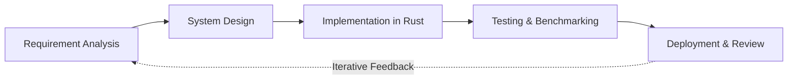

## 2. Basic Block Diagram (System Architecture)
**Location:** Chapter 3
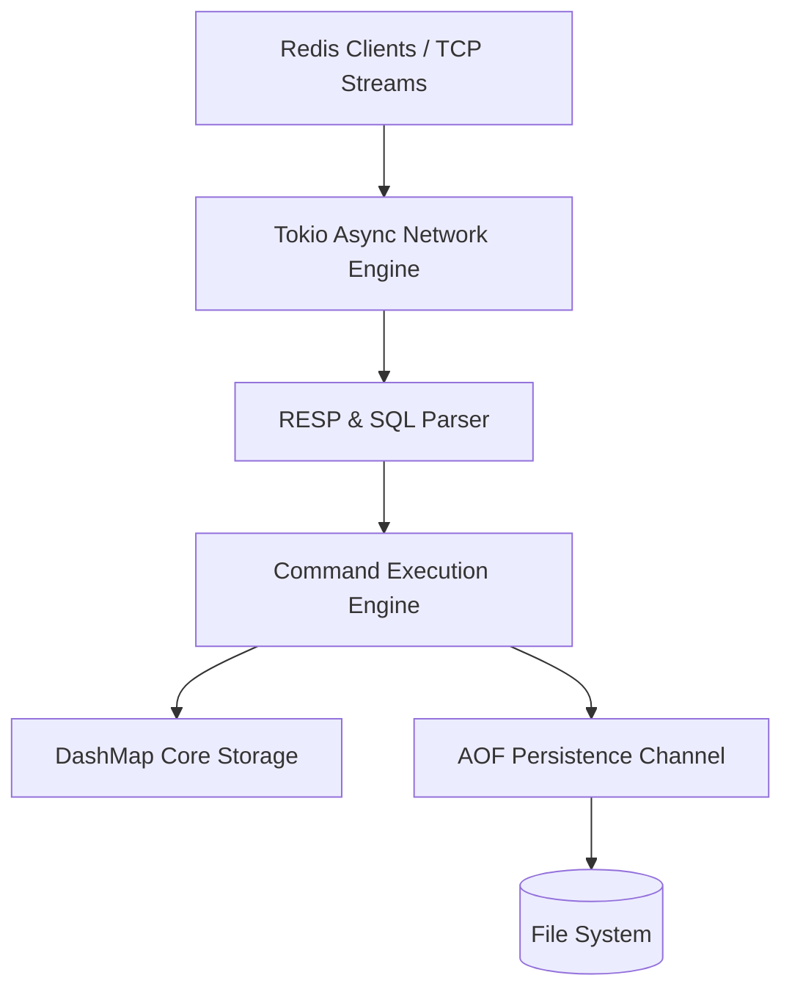

## 3. System Workflow Flowchart
**Location:** Chapter 3
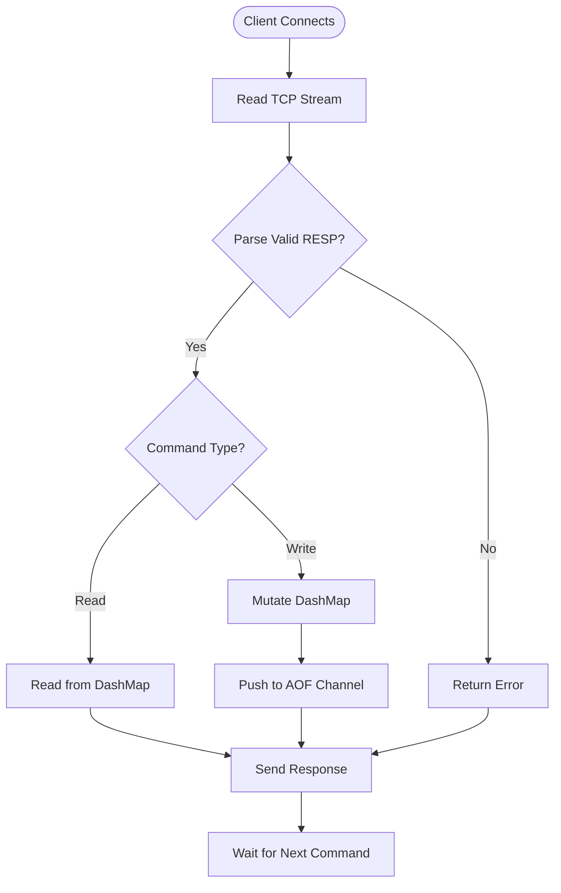

## 4. Hash Map Sharding Diagram (DashMap)
**Location:** Chapter 3
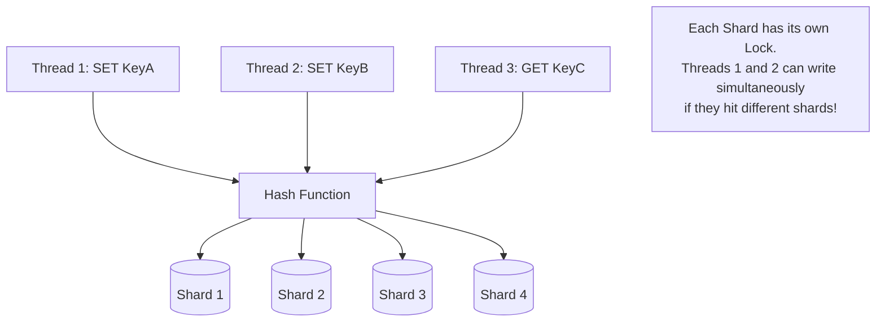

## 5. Time-Series Layout
**Location:** Chapter 3
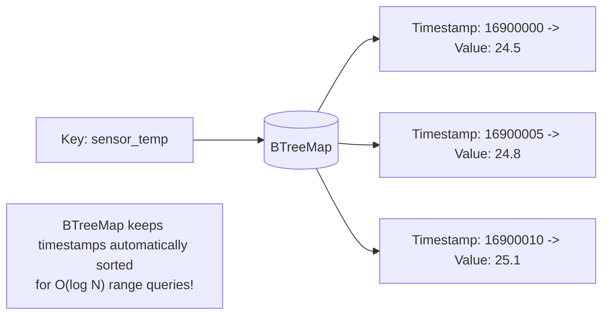

## 6. Multi-Tenancy Architecture
**Location:** Chapter 3
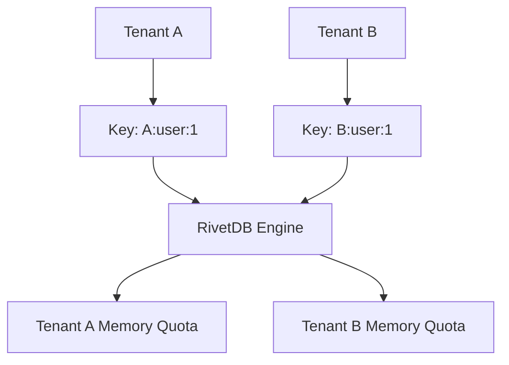

## 7. Network Event Loop Sequence Diagram
**Location:** Chapter 4
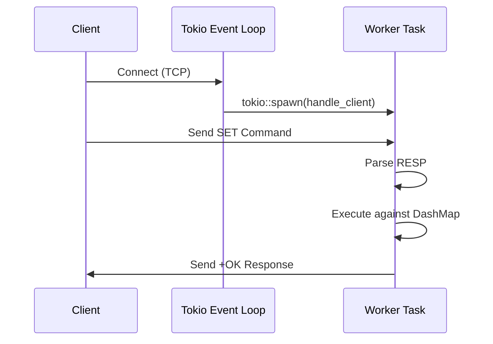

## 8. Asynchronous AOF Persistence Workflow
**Location:** Chapter 4
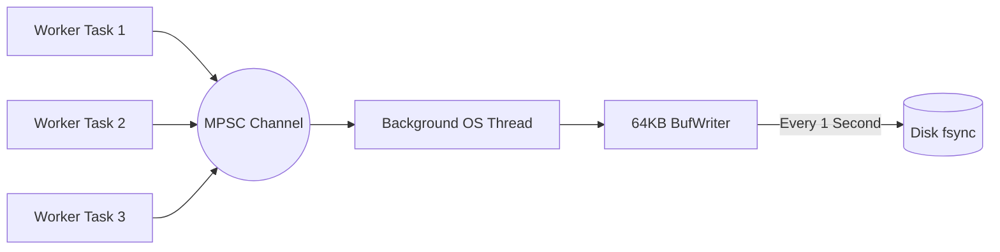

## 9. Memory Eviction Algorithm Flowchart
**Location:** Chapter 5
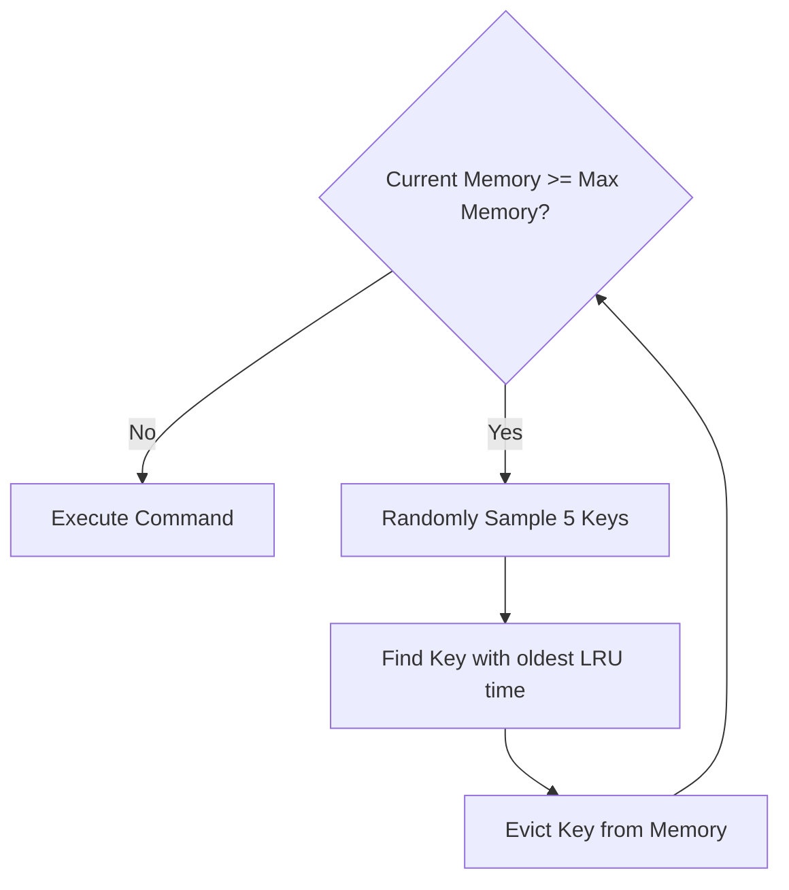

## 10. SQL Query Execution Flow
**Location:** Chapter 4
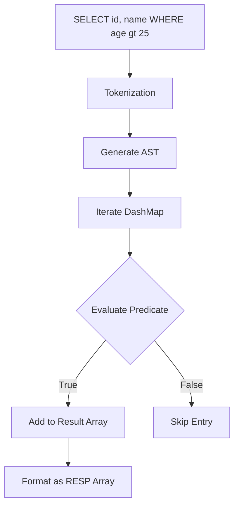

## 11. Literature Review Timeline/Comparison
**Location:** Chapter 2
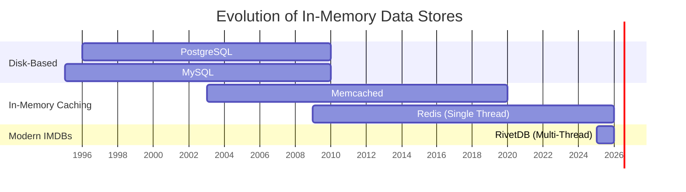

## 12. Benchmark Architecture
**Location:** Chapter 6
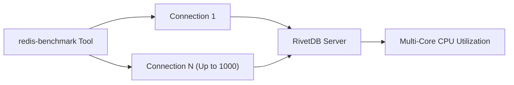
